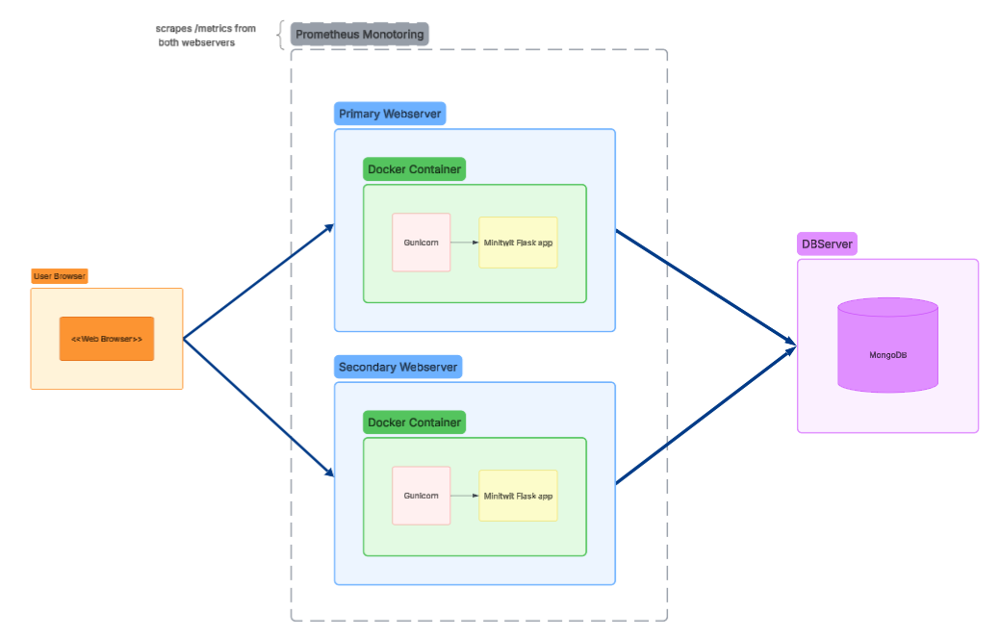
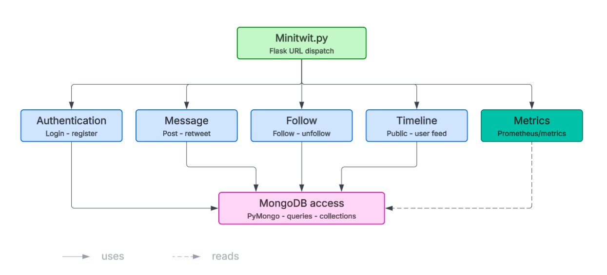
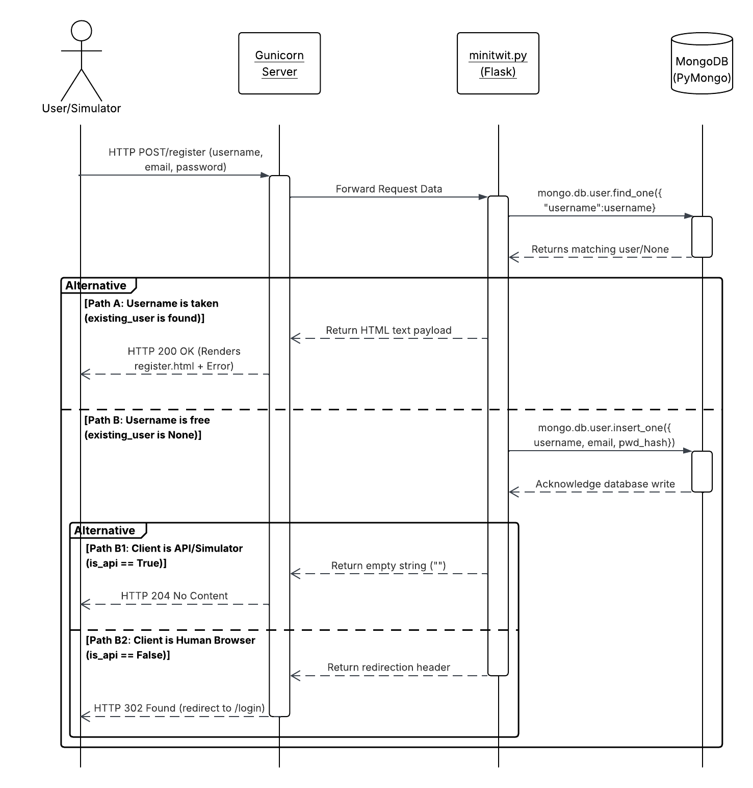
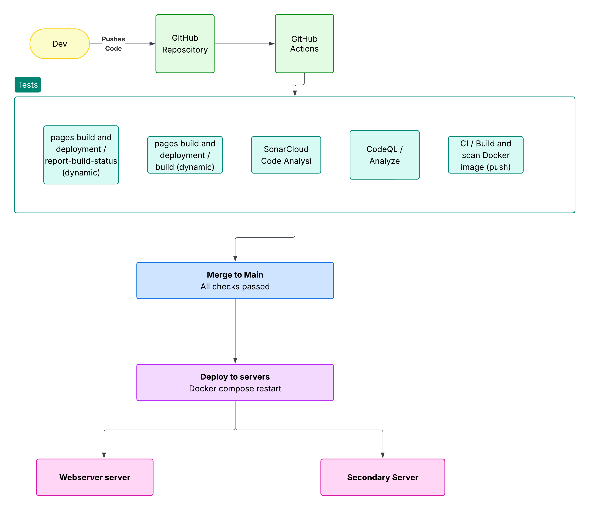
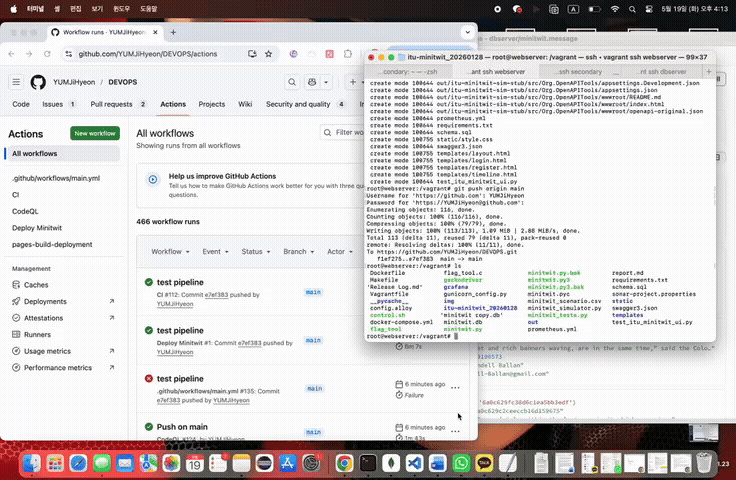
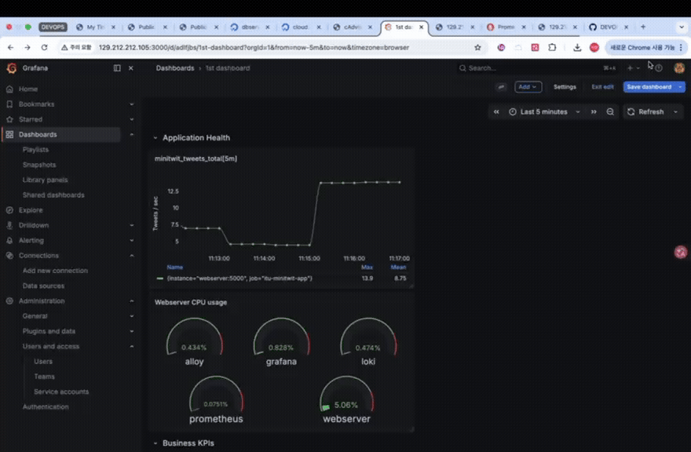
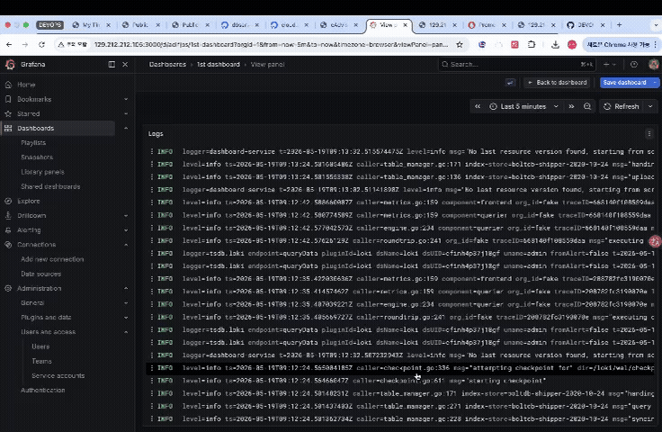
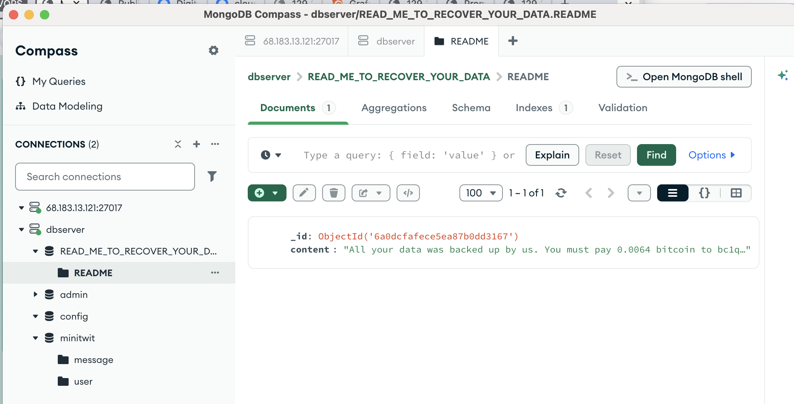

# DevOps, Software Evolution and Software Maintenance 
## Cousre code: KSDSESM1KU

### Exam assignment by:

Erle Sognnæs:
s25128@itu.dk

Jihyeon Yum:
s25126@itu.dk

Margrét Edda Friðgeirsdóttir:
s25117@itu.dk

Mathias Anakin Alm:
matal@itu.dk

### (Formal Requirements - remove)
Make sure that you link all artifacts that you consider constitutional to your projects together with short descriptions of the linked artifacts from your reports, i.e., link all necessary repositories, issue trackers, monitoring/logging systems, etc.

Since this is a group project and the report is written by a group make sure to indicate for each section the respective author(s).

## Table of content
* **[1. Introduction](#1-introduction)**
* **[2. System's Perspective (Architecture)](#2-systems-perspective-architecture)**
  * *[2.1 System Architecture](#21-system-architecture)*
  * *[2.2 System Design](#22-system-design)* 
  * *[2.3 Dependencies](#23-dependencies)* 
  * *[2.4 Current State](#24-current-state)* 
* **[3. Process Perspective](#3-process-perspective)**
  * *[3.1 Infrastructure as Code (IaC)](#31-infrastructure-as-code-iac)* 
  * *[3.2 CI/CD Pipeline](#32-cicd-pipeline)* 
  * *[3.3 Monitoring](#33-monitoring)* 
  * *[3.4 Logging](#34-logging)* 
  * *[3.5 Security Hardening](#35-security-hardening)* 
  * *[3.6 Availability and Scaling](#36-availability-and-scaling)* 
* **[4. Reflection Perspective](#4-reflection-perspective)** 

 
## 1) Introduction
This report details the design, evolution, and operation of the ITU-MiniTwit system for the 'DevOps, Software Evolution, and Software Maintenance' course. Our group aimed to transform the legacy application into a robust, scalable service by applying modern DevOps principles.

We implemented Infrastructure as Code (IaC) using Vagrant to ensure reproducible environments. To achieve high availability, we deployed an Nginx load balancer integrated with Keepalived, creating an automated failover mechanism. Furthermore, we established comprehensive observability by integrating Prometheus and Grafana for system monitoring and log aggregation. The entire development lifecycle is managed through a CI/CD pipeline, which automates testing and deployment processes. The following sections evaluate our engineering choices across three major domains: the *System's Perspective* (our physical and structural layouts), the *Process Perspective* (our automated integration, testing, provisioning, and observation loops), and the *Reflection Perspective* (the lessons, friction points, and culture shifts encountered along the way).

## 2) System's Perspective (Architecture)
Write something here?
The System's Perspective explains the structural layout, component boundaries, and runtime behaviors of our ITU-MiniTwit infrastructure. By analyzing our system at different levels, from the physical servers down to individual code modules, we show how our modular design keeps our development and production environments consistent, isolates components to prevent system-wide failures, and allows us to easily add server capacity as traffic grows.

A description and illustration of the:
	-Design and architecture of your ITU-MiniTwit systems.
	-All dependencies of your ITU-MiniTwit systems on all levels of abstraction and development stages. That is, list and briefly describe all technologies and tools you applied and depend on.
	-Describe the current state of your systems, for example using results of static analysis and quality assessments.

### 2.1) System Architecture
Our system architecture focuses on separating UI logic, business logic, and long-term storage to ensure compatibilitiy across our resources and make software updates safer to manage.

#### Allocation View

As seen in the Allocation View above, our system is split into three layers. We have the frontend/UI layer, which consists of the MiniTwit browser application that we received at the beginning of the course. The logic layer is comprised of two web servers: a primary web server and a secondary web server. We implemented Docker containers to run our application together with all required dependencies, ensuring that the application remains consistent across different servers and environments. We also implemented Gunicorn, which hosts the MiniTwit Flask application. Gunicorn handles incoming HTTP requests before forwarding them to the main application. Both web servers communicate with the MongoDB database server, which stores the application’s data. Finally, Prometheus monitors the system by scraping metrics data from the web servers. As a side note, our system is not a perfectly separated three-layer architecture, since parts of the logic layer also interact directly with the data layer.

### 2.2) System Design
For this project we used Flask which is a lightweight Python web framwork. It was chosen as it was recommended to us for this project and provided us a simple way to build the MiniTwit application in Python. Flask was used to implement routing, user authentication, and database integration. For the frontend it shows all the pages the users sees using HTML templates that we get from Jinja2, Flasks template engine. It also sends data from Python into the HTML like tweets and usernames. Flask has a internal support library Wekzeug. In our project it used for securely hashing passwords, validating requests, handling sessions and routing internally. 

Regarding the backend, Flask handles all user requests and responses such as log ins, tweets, follow requests and logouts. Flask takes those requests and sends them to Flask-PyMongo which we use to send and recive data from our MongoDB server. Flask-PyMongo is built on top of PyMongo which is the official Python driver for MongoDB which allows us to access low-level functionality in our data base. 

#### Module View

The core of the application logic is handled by minitwit.py, which maps incoming web traffic to spesific python function. As shown in the diagram, we organized our main application features into different logical sections. Authentication controls user registration and login, Message handles posting new tweets or retweeting others posts, Follow handles starting to follow or unfollowing other users, Timeline queries the database to build the public and personal feeds. We also have a Metrics module that hooks into our Prometheus configuration to track system performance. All these functional pieces feed down into a shared data-access tier, MongoDB access, which is the "last stop" for the information before it translates to code readable for the database, and reaches the storage. This modular structure improves maintainability by separating responsibilities into focused components. It also simplifies testing and future development, since changes to one feature area can often be made without affecting unrelated parts of the system.

#### Component and Connector view  

This sequence diagram shows the lifecycle of registering a user in our system. The prosess starts when a client, either a User or a Simulator, sends their information through clicking submit. Gunicorn catches the data and forwards it to our Flask application. Flask queries MongoDB with find_one to look for the username in the database, and MongoDB returns if the username is taken or not.
Here the logic splits into alternative branches.
- Path A represents when the username is taken. If this is the case, execution stops and an error message is sent through the system which is shown to the user as "The username is already taken"
- Path B represents when the username is free. In this case Flask hashes the password, and sends insert_one to the database.

After successful registration the execution enters the inner alternative block, which handles whether the registration is done by a Simulator or a Human User.
- Path B1 represents if the client is a Simulator. The system returns an empty string and a HTTP 204 to register the success, but not use necessary internet speed with opening the login page.
- Path B2 represents if the client is a Human user. Then Flask activates the redirect function, which sends the user to the login page.

### 2.3) Dependencies
The system is implemented mainly in Python using the Flask web framework. It uses MongoDB as the database through PyMongo. Passwords are handled with Werkzeug security utilities. Monitoring is supported through Prometheus using prometheus_client and prometheus_flask_exporter. The application is containerized with Docker and orchestrated through Docker Compose. Development and version control are handled with Git and GitHub, while CI/CD is handled through GitHub Actions. Code quality/security analysis is configured through Sonar using sonar-project.properties.

Our deployment dependencies are illustrated in our Allocation view diagram. 

### 2.4) Current state

| Area             | Current state                            |
| ---------------- | ---------------------------------------- |
| Web framework    | Flask                                    |
| Database         | MongoDB via Flask-PyMongo/PyMongo        |
| Testing          | Pytest and Selenium                      |
| Static analysis  | Flake8                                   |
| Formatting       | Black                                    |
| Deployment       | Gunicorn                                 |
| Monitoring       | Prometheus exporter                      |
| Main improvement | Record actual test/lint results in CI/CD |

Write here - description of current state
The production setup currently remains stable across both web nodes, processing heavy, concurrent client traffic from our automated simulator. By introducing automated formatting via Black and code quality linting via Flake8, our code maintainability metrics have improved significantly. However, a remaining architectural gap is our tight coupling between the application logic and the database layer; parts of `minitwit.py` circumvent an isolated data-access layer to communicate directly with MongoDB. Our near-term goal is to fully decouple this integration so database schema variations will not disrupt business logic downstream. (check! - dont know if the table is correct, and the text is based of the table)

## 3) Process perspective
Note (remove): This perspective should clarify how code or other artifacts come from idea into the running system and everything that happens on the way.

In particular, the following descriptions should be included:

A complete description and illustration of stages and tools included in the CI/CD pipelines, including deployment and release of your systems.
	- Diagram: CI/CD Pipeline

Write here
The Process Perspective highlights the automated lifecycles that construct, validate, provision, and maintain our systems. This section outlines how an updated code snippet evolves from an engineer's machine into a stable piece of infrastructure running in production, along with the continuous runtime monitoring that keeps it healthy. (this kinda sounds like our program works flawlessly, how do we write it less so lol)

### 3.1) Infrastructure as Code (IaC)

To ensure environments are entirely reproducible and resilient against hardware failures, our absolute state configuration is managed as code rather than manual server commands.

#### IaC in Action
	
We implemented Infrastructure as Code (IaC) using Vagrant combined with the DigitalOcean provider to ensure our production environment is reproducible and standardized. Our entire infrastructure is orchestrated via a single Vagrantfile, which automates the creation and configuration of three virtual droplets: dbserver, webserver (Primary), and secondary.

The Vagrantfile includes shell provisioning scripts that automate the installation of core dependencies, including Docker, Docker Compose, and Nginx. It also handles complex network configurations, such as setting up Keepalived on both web servers to manage a Virtual IP (VIP) for automated failover. Furthermore, the IaC layer handles the specific preparation required for Observability in a multi-process environment. This includes the automated creation of shared memory directories (e.g., /app/prometheus_metrics) with restricted permissions (755) to enable consistent metric aggregation across Gunicorn workers. By executing a single command, vagrant up, the entire production-grade infrastructure is built from scratch in minutes, eliminating manual configuration errors and ensuring high system reliability
Our provisioning setup builds up our isolated environment from a blank slate. As captured in the animation above, our scripts handle downloading core dependency layers, initializing the Docker daemon engines, structuring the virtual container bridges, and linking our web nodes cleanly to our isolated database servers without causing configuration drift between staging and production nodes. (is it tho? it is definetly some problems somewhere)

### 3.2) CI/CD Pipeline

Our software deployment loop runs automatically whenever a branch update is committed to source control.

As seen in the diagram above, our CI/CD pipeline starts when a developer pushes their code onto our Github reposoitory. Then the Github Actions is activated and the tests run automaticlly and in parellel. 

The pipeline includes automated build processes, dynamic page deployments, SonarCloud static code analysis, CodeQL security analysis, and Docker image build and scan operations. These automated checks help ensure code quality, security, and deployment consistency before changes are merged into the main branch.

Once all checks have successfully passed, the changes are merged into the main branch. The updated application is then deployed to both the primary web server and the secondary web server using Docker Compose restart procedures.

This CI/CD pipeline automates large parts of the development and deployment workflow, reducing manual configuration errors and supporting continuous integration and continuous deployment practices.

#### CI/CD in Action

### 3.3) Monitoring 

We monitored our system using a Prometheus and Grafana stack to ensure infrastructure health, application performance, and business visibility. Monitoring focused on numerical metrics to identify trends and system states. 

To monitor resource consumption, we utilized cAdvisor, collecting real-time data from Docker containers. We specifically tracked CPU usage per container using the query:sum(rate(container_cpu_usage_seconds_total{id!="/"}[1m])) by (name) * 100. This allowed us to identify performance bottlenecks in services like MongoDB or the web server.
Application health was monitored via prometheus-flask-exporter in minitwit.py. We tracked flask_http_request_total for 4 diffrent types of HTTP requests such as: 

		- successful request (200)
		- redirects (302) 
		- missing routes (404) 
		- unsupported request methhods (405)
		
This numerical tracking enabled the detection of security anomalies, such as vulnerability-scanning traffic (e.g., BXJZ, PROPFIND, HIAS). 
Business KPIs were tracked with straightforward PromQL queries. We monitored total registered users using max(minitwit_users_total). The max function was essential in our Gunicorn multiprocess environment to ensure a consistent total was displayed despite multiple workers reporting independently. User activity was visualized through tweet frequency using rate(minitwit_tweets_total[5m]), providing insights into real-time system engagement.

To handle Gunicorn’s multiprocess architecture, we implemented GunicornInternalPrometheusMetrics and configured the PROMETHEUS_MULTIPROC_DIR environment variable. This ensures that metrics from all workers are aggregated into a single consistent state rather than reporting inconsistent partial data.

#### Monitoring Dashboard in Action

### 3.4) Logging
Our system logged textual event data using Grafana Loki for centralized aggreation, collected via Alloy. While monitoring tracked request counts, our logs capure the actual content of HTTP requests, including methods, paths, and client details.

We recorded application-level debug messages, such as user registrations and tweet attempts, alongside critcal system errors like Gunicorn worker timeouts and Python tracebackes. This textual record was essential for detailed root-cause analysis. By correlating Prometheus metric spikes with specific Loki log entries, we significantly reduced our mean time to resolution (MTTR) during system incidents. 

#### Logging Dashboards in Action

As visualized in the logging dashboard above, our system continuously sends all application logs directly into Grafana Loki. Whenever an application exception triggers, or an unrecognized scanner resource pathway is encountered, the stack traces are indexed and searchable in real time. This keeps our debugging workflow fast and data-driven without requiring explicit, manual shell access to our active production servers.
(are they indexed? also the logs are a bit messy tho, should we maybe write that it could have been cleaned up or something?)

		
### 3.5) Security hardening

We security hardened our deployment by making sure production host data boundaries are fully isolated from our public code history:
* **Environment Files (`.env`):** We use `.env` files to store all our database passwords and secret keys locally on the server. This keeps our sensitive credentials completely safe from being accidentally pushed to GitHub where anyone could see them.
* **Docker Ignore (`.dockerignore`):** This file acts like a filter during our builds. It makes sure that random junk files, local test logs, and temporary development data don't get accidentally bundled into our live production containers.
* **Runtime Scans:** We set up CodeQL inside our GitHub pipeline to act as an automated security check. Every time someone pushes a new pull request, the pipeline automatically scans the code for security bugs, unescaped database queries, or leaked keys before we are allowed to merge it.

### 3.6) Availability and scaling

How do you handle availability and scaling in your systems?
Write here
Our application ensures high availability through a redundant web server layer. By deploying identical primary and secondary web server instances behind Gunicorn, the system can withstand unexpected traffic spikes or individual container restarts. If a rolling update is triggered during a CI/CD pipeline execution, one server continues processing incoming simulator loads while its partner reinitializes, completely reducing downtime for active clients. Storage constraints are reduced by utilizing document-based MongoDB instances which can be scaled horizontally through sharding as our tweet metrics and user data volumes expand.
(i guess we should be carefull with writing "high availability" since it's like down half of the time...)
this needs to be made easier, and lowkey write something about that this is the purpose/idea, but it doesn't always work..

 ## 4) Reflection Perspective
 (500/2500 word)
Describe the biggest issues, how you solved them, and which are major lessons learned with regards to:

	- evolution and refactoring
	- operation, and maintenance of your ITU-MiniTwit systems. 
		- Link back to respective commit messages, issues, tickets, etc. to illustrate these.

Also reflect and describe what was the "DevOps" style of your work. For example, what did you do differently to previous development projects and how did it work?

 ## 5) Use of Generative AI
 (100/2500 word)
describe how generative AI tools have been used and briefly reflect and discuss how they supported or hindered your work process.

#### 1.) TODO: Assure Information Correctness 

#### 2.) TODO: Polish Project Repositories and Documentation 

#### 2.1.) Create a .mailmap file in the root of your repositories 

#### 2.2.) Create Four Videos Demonstrating your ITU-MiniTwit System in Production 

#### 2.3.) TODO: Update the main readme file 
	
TODO: System's Perspective 

TODO: Process' perspective 

TODO: Reflection Perspective 

TODO: Use of Generative AI -> ✨ YES ✨ 

 idea: We used it when we got stuck or encountered unexpected errors.  It has been a life saver for the most part.  

